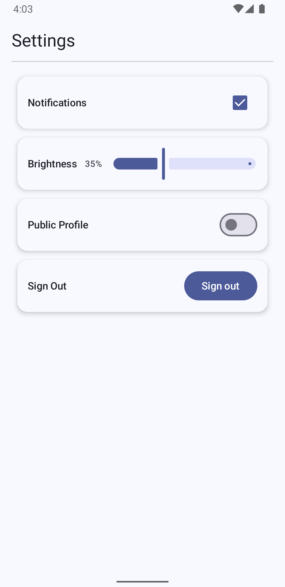

# CS501 HW3 Q1 — Settings Screen (Polished Rows)

A Jetpack Compose **Settings** screen with clean alignment and consistent styling.

- Main layout uses a `Column`
- Each setting is a `Row` with:
  - **Left:** label text (keeps space using `weight(1f)`)
  - **Right:** a control (Checkbox / Switch / Slider / Button)
- Rows use rounded corners and a **drop shadow** for a modern “card row” feel

---

## Screenshot

---

## Features / Requirements Checklist

### Layout
- Main container is a `Column`
- Each setting row is a `Row`
  - Left side uses a `Column` / text area with `Modifier.weight(1f)` to prevent truncation
  - Right side contains a control aligned consistently
- Controls stay aligned across rows

### Material 3 components used (6+)
- `Scaffold`
- `Card`
- `Divider`
- `Checkbox`
- `Switch`
- `Slider`
- `Button`
- `SnackbarHost` (if included)

### Modifier requirements demonstrated
- `padding(...)`
- `fillMaxWidth()`
- `weight(...)`
- `heightIn(...)` and/or `sizeIn(...)`
- `align(...)` (used to keep controls vertically aligned)
- Uses at least one of:
  - `clip(...)`
  - `background(...)`
  - `clickable(...)`
  - `border(...)`

---

## How it works

- State is stored with `rememberSaveable` for each control (toggle/slider values).
- Each row is implemented as a reusable composable so layout rules stay consistent.
- `weight(1f)` on the left label area ensures long text doesn’t push the control off-screen.

---

## AI Disclosure

Parts of this project (including UI structure, Compose layout logic, and README text) were created with assistance from an AI tool (ChatGPT). All code was reviewed, edited, and tested by the student, and final implementation decisions were made by the student.
